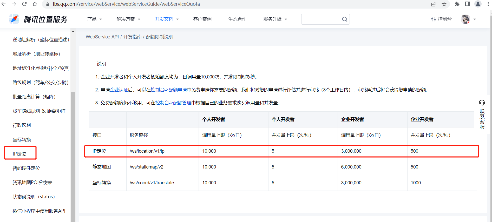

# 前端获取 ip 及位置信息工具

## 快速开始

### 安装

```bash
npm install web-ip-util --save
```

### 使用

```javascript
import { getDefaultIpInfo } from 'web-ip-util'

getDefaultIpInfo([
  {
    id: 'qq',
    data: {
      key: '输入腾讯位置服务申请的key'
    }
  }
]).then(res => {
  console.log('res', res)
})
```

## API 方法

### `getDefaultIpInfo`

> 该方法用于载入默认配置

- 参数 `ElementTYpe[]`

- 示例

```javascript
getDefaultIpInfo([
  {
    id: 'qq', // 匹配默认配置对应的腾讯位置服务
    data: {
      // 由于腾讯位置服务的key是私有的，需要自行配置，然后工具会把data参数合并到默认配置中
      key: '输入腾讯位置服务申请的key'
    }
  }
]).then(res => {
  console.log('res', res)
})
```

目前默认配置了如下服务：

- [腾讯位置服务](https://lbs.qq.com/service/webService/webServiceGuide/webServiceIp) (jsonp)

  > 腾讯位置服务 IP 定位配置限额如下：



- [太平洋](https://whois.pconline.com.cn/) (jsonp)
- [IP Geolocation API](https://ip-api.com/) (jsonp)
- [IP.SB Free API](https://ip.sb/api/) (jsonp)

### `getIpInfo`

> 该方法用于载入自定义配置 (多个)

- 参数 `ElementTYpe[]`

- 示例

```javascript
getIpInfo([
  {
    id: 'ip-api',
    url: 'http://ip-api.com/json',
    data: {
      callback: 'callback',
      lang: 'zh-CN'
    },
    jsonpCallback: 'callback',
    resMapping: {
      ip: 'query',
      province: 'regionName'
    }
  }
]).then(res => {
  console.log('res', res)
})
```

### `getElementPromise`

> 该方法用于载入自定义配置 (单个)

- 参数 `ElementTYpe`
- 示例

```javascript
getIpInfo({
  url: 'http://ip-api.com/json',
  data: {
    callback: 'callback'
  },
  jsonpCallback: 'callback',
  resMapping: {
    ip: 'query'
  }
}).then(res => {
  console.log('res', res)
})
```

## 参数类型

### `ElementTYpe`

| 参数          | 说明                   |    类型    | 必须参数 |  默认值  |
| ------------- | ---------------------- | :--------: | :------: | :------: |
| url           | 服务地址               |   string   |    是    |    -     |
| resMapping    | 服务返回结果映射       | ResMapping |    是    |    -     |
| jsonpCallback | jsonp 回调的函数名     |   string   |    是    | callback |
| id            | 配置多个服务的标识区分 |   string   |    否    |    -     |
| data          | 拼接 url 的参数配置    |   object   |    否    |   null   |

### `ResMapping`

> 返回结果多层级时，中间用 `.` 分隔

| 参数     | 说明                   |  类型  | 必须参数 | 默认值 |
| -------- | ---------------------- | :----: | :------: | :----: |
| ip       | ip 字段映射            | string |    是    |   -    |
| province | 省名称字段映射         | string |    否    |   -    |
| city     | 城市名称字段映射       | string |    否    |   -    |
| district | 区名称字段映射         | string |    否    |   -    |
| 其他     | 自定义返回结果字段映射 | string |    否    |   -    |
